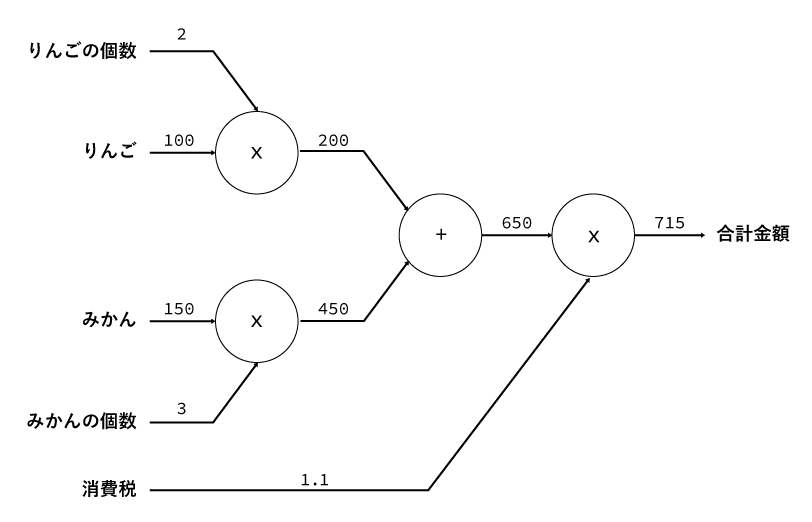
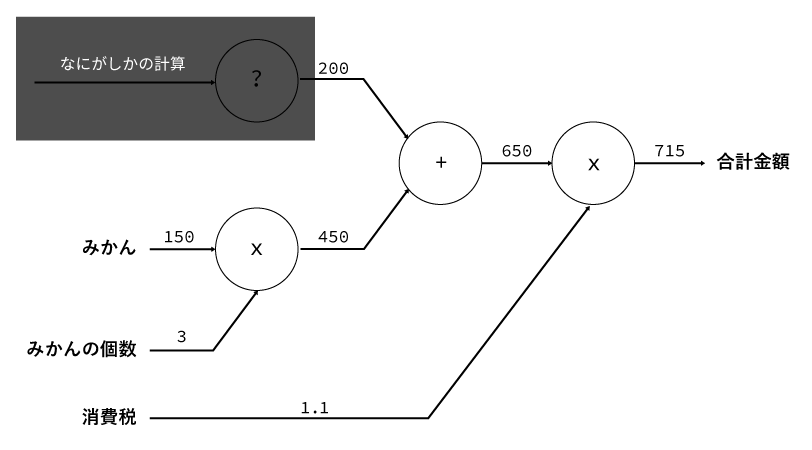
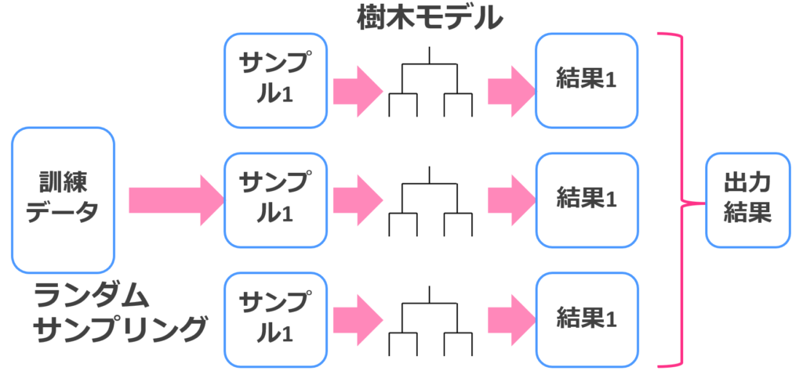
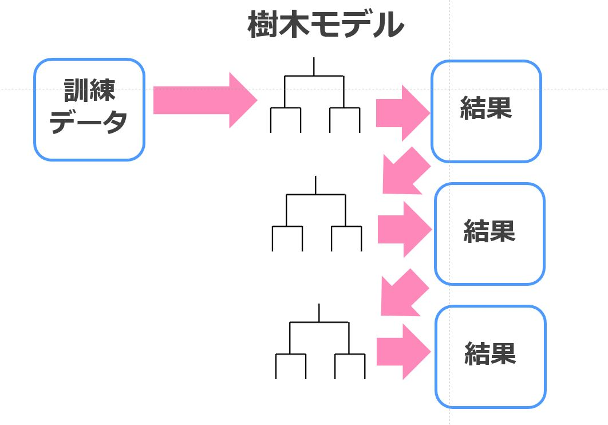
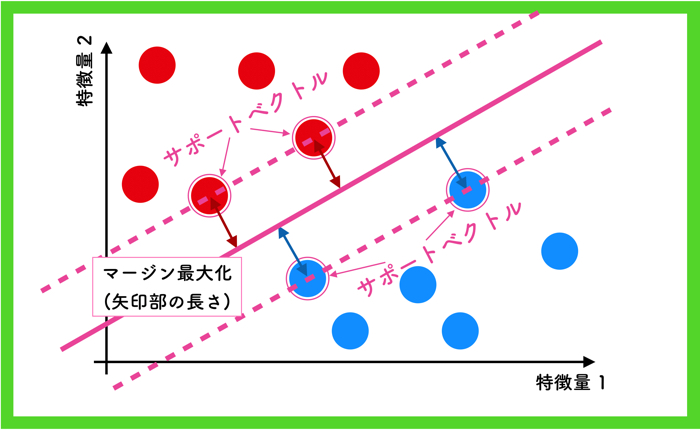
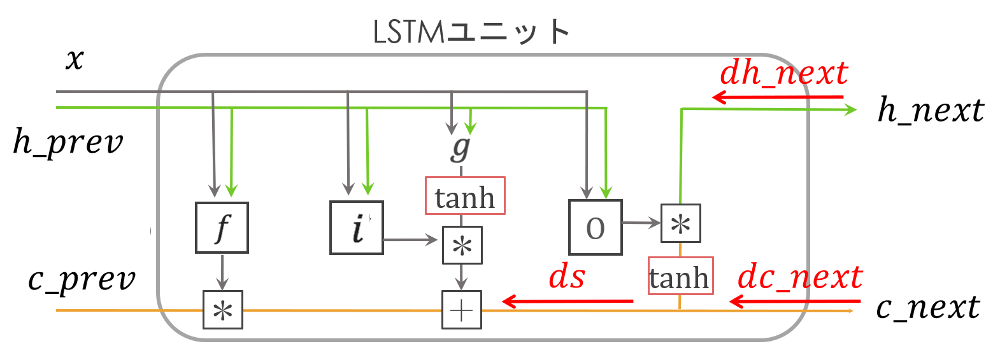

# E資格テスト前まとめ  
とりあえず感想としては、
+ E資格めっちゃムズイ
+ 「深層学習」の本は「なぜそうなるか」とても詳しく書いてくれている。ただ読み解くには基礎知識も時間もメンターもメンタルも足りない。
+ MarkDown言語めっちゃ便利。最悪HTMLタグ使えるのが助かる。ただタイトルには番号を振ってほしい(1.2.3. hogehogeみたいに)
+ VisualStudioCodeめっちゃ便利。mdもjpynbも開けて、拡張機能があって、gitにも対応しているのがホント便利。ただ1回だけデータ消えたorz
  + だれか早くLatexの拡張機能作ってください！Katexだと微妙に違って面倒なんです！！
## 情報理論
### 期待値
1回の施行でその確率変数がとると期待される値。  
なお、$x_k$は$k$回目の値、$P_{x_k}$は$k$回目の確率。

$$E_{(x)}=\sum_{k=1}^nx_kP_{(x_k)}$$
### 分散
確率変数の取りうる値の散らばり具合。バリアンスとも言う。  

$$V_{X}=\sum_{k=1}^nE_{(x_k^2)}-E(x_k)^2$$
### 共分散
2組の対応するデータの間の関係を表す数値。

$$Cov_{(X,Y)}=E_{(XY)}-E_{(X)}E_{(Y)}$$

### 周辺確率と同時確率
+ 周辺確率  
ただ1つだけの事象が起こる確率。  
例えば、「全校生徒の中で、男子が登校してくる確率」
+ 同時確率  
複数の事象が起こる確率。  
例えば、「全校生徒の中で、運動部の男子が登校してくる確率」  
同時確率を全て足し合わせれば、周辺確率になる。  
例えば、「運動部の男子+文化部の男子+帰宅部の男子」(それぞれ同時確率)＝「男子」(周辺確率)

## 計算グラフで連鎖率の一般型  
---
### 計算グラフとは 
 
 計算グラフは部分的に不明な箇所があってもほかの要素には影響を与えない。  これを「局所性」という。  
 下図でいうと、「りんごの値段と個数」を隠したが、「みかんの買い物の計算」には影響が出ない。  
 この局所性があるおかげで、勾配の計算(誤差逆伝搬)が簡単に行える。  
 

### 計算グラフの計算方法
 #### 加算ノード
 加算ノードの逆伝搬は、**入力値Eをそのまま**伝達する。  
 
 #### 乗算ノード
 乗算ノードの逆伝搬は、**入力値E×順伝搬を入れ替えた値**を伝達する。  
 
 #### ノード計算の例
 逆伝搬していくと、「りんごは結果に2.2倍の影響がある」ことがわかる。  
 
 #### 連鎖率との関係
 ゼロつく2ではチェインルールと紹介されている。  
 連鎖率の定義は下記となる。
 >微分法において連鎖律（れんさりつ、英: chain rule）とは、複数の関数が合成された合成関数を微分するとき、その導関数がそれぞれの導関数の積で与えられるという関係式のこと。  
 
 計算グラフが、局所的な計算をノードという単位に分解して行える原理は連鎖率によるもの。
### 微分
 計算グラフのメリットは、微分しにくい関数を簡単に微分できること。  
 #### シグモイド関数
 

 $$y=\frac{1}{1+e^{-x}}\tag{覚えること！}$$
 また、逆伝搬は下記となる。

 $$y'=\frac{\partial L}{\partial y}y(1-y)\tag{覚えること！}$$
   
 #### ソフトマックス関数と交差エントロピー誤差  
 
 ソフトマックス関数  

 $$y_k=\frac{e^{a_k}}{\sum_{i=1}^ne-{a_i}}\tag{覚えること！}$$
 交差エントロピー誤差

 $$E=\sum_{n=1}^N(-\log (y_{n,t_n}))\tag{覚えること！}$$
 ソフトマックス関数と交差エントロピー誤差の微分は下記となる。

 $$\frac{\partial L}{\partial y}(y_k-t_k)\tag{覚えること！}$$

  #### Affine変換
  

  $$
  Y=X\cdot W+B \tag{覚えること！}\\
  $$
  逆伝搬は下記となる。  

  $$
   \frac{\partial E}{\partial X}=\frac{\partial E}{\partial Y}\cdot W^{\mathrm{T}}\tag{覚えること！}
  $$
<br>

  $$
   \frac{\partial E}{\partial W}=X^{\mathrm{T}}\cdot \frac{\partial E}{\partial Y}\tag{覚えること！}
  $$
 
 
## Lpノルム定義式　☆数式
---
 ### Lpノルムの定義
 ベクトルxをn次元、つまり、$x=(x_1,x_2,\cdots,x_n)$ としたとき、その時のLpノルムは次のように定義されます。  

 $$\|x\|_p=(|x_1|^p+|x_2|^p+\cdots +|x_n|^p)^{\frac{1}{p}}\tag{覚えること！}$$

##  L1ノルムとL2ノルム☆数式
---
 ### L1ノルム
 上記Lpノルムの定義より、$\|x\|_1=|x_1|+|x_2|+\cdots +|x_n|$
 ### L2ノルム
 $$\|x\|_2=\sqrt{|x_1|^2+|x_2|^2+\cdots +|x_n|^2}$$
 
## L2正則化項入れた誤差関数の微分☆数式
---
 ### 正則化とは
 >正則化(regularization)とは、不良設定問題を解いたり過学習を防いだりするために、情報を追加する手法である。モデルの複雑さに罰則を科すために導入され、なめらかでないことに罰則をかけたり、パラメータのノルムの大きさに罰則をかけたりする。  
 >
>正則化の理論的正当化はオッカムの剃刀にある。ベイジアンの観点では、多くの正則化の手法は、モデルのパラメータの事前情報にあたる。

 ### L2正則化をする理由
 機械学習モデルでは、未知データへの予測精度を高めるために訓練データを学習します。  
 しかし、過学習で外れ値やノイズまで学習してしまうと、未知データへの予測精度(汎化性能)が落ちることがある。  
 過学習が起きる原因として、①データが少ない、②変数が多い、③パラメータが大きすぎる といったことがある。  
 ③パラメータが大きすぎる と過学習が起きやすいので、正則化でパラメータの大きさに制限をかける(パラメータノルムペナルティ)。  
 誤差関数$erf(x)$ = 損失関数$f(x)$ + L2正則化項  

 $$
  erf(x)=minf(x)+\frac{\lambda}{2}\sum_{i=1}^n|\omega _i|^2\\
  erf(x)'=\lambda \omega_i
 $$
 
 
## ドロップアウト実装（mask）★コード
---
```python
class Dropout():
    def __init__(self, dropout_ratio=0.5):
        self.dropout_ratio = dropout_ratio                 #ドロップアウト率を代入。
        self.mask = None

    def __call__(self, x, train_flg=True):
        if train_flg:                                      #訓練時のみドロップアウトを行う。
            randommatrix = np.random.rand(*x.shape)        #入力xと同じ形のランダム行列を作る
            self.mask = randommatrix > self.dropout_ratio  #Pandasのmaskメソッドでブール配列(True or False)を作る
            return x * self.mask                           #入力の一部を0にして返す
        else:
            return x * (1.0 - self.dropout_ratio)

    def backward(self, dout):
        return dout * self.mask                            #順伝搬時にマスクしたノードの出力を0にする
```


## ドロップアウトとドロップコネクト
---
+ ドロップアウト
  + 学習時に中間層の**ノード**を任意の割合でランダムにマスクしながら学習する。
  + ドロップコネクトに比べて安定性がある。
+ ドロップコネクト
  + 学習時に中間層の**重み**を任意の割合でランダムにマスクしながら学習する。
  + ドロップアウトに比べて性能が高くなる。
## ドロップアウトとアンサンブル学習
---
+ アンサンブル学習  
複数の学習器を⽤いることでより良い結果を得る。厳密にはバリアンスを⾼めバイアスを抑え
る⼿法なので、元々バイアスが低い学習器(SVM)等はアンサンブル学習の意味がないし、やり
すぎるとバリアンスが⾼くなり過学習する。
  + バギング  
    + 複数の学習器を並列に⽤いる⼿法。
    + 並列計算ができる利点がある。
    
  + ブースティング  
    + 複数の学習器を直列に⽤いる⼿法。  最初の学習器でうまく推定できなかった部分を推定するために重みをつけて次の学習器で学習を⾏う。
    + バギングと比べて精度が高い。
    

## サポートベクターマシン(SVM)
クラスを明確に分ける境界線を引くための手法。  
境界から最も近いベクトル(特徴を持った**点**のこと。力学のベクトルと間違えないように！)との距離を最大にする。  
また、選ばれたベクトル(複数形)は**サポートベクトル**と呼ばれる。
+ 前提条件：線形分離可能であること  
+ メリット：計算コストが少ない  
  + サポートベクトル以外の点は境界を引くのに関係ないので、計算しなくて良いため




# 「深層学習」まとめ
## 第1～7章は省略
## 第8章 深層モデルの訓練のための最適化
ニューラルネットワークの訓練はコスト(時間、マシン、電気代)がかかる。  
訓練前に、コスト関数J($\theta$)を大幅に減少させる$\theta$を発見することで最適化を行う。  
なお、最適化とは「制約を満たす中で目的を最もよく達成する様な解を見つけること」である。  
+ 純粋な最適化と機械学習の最適化の差異
  + 純粋な最適化  
  生成分布$p_{data}$に従う。なお、$j(\theta)$はコスト関数、$\mathbb{E}[f(x)]$は$f(x)$の期待値、$L$は損失関数を表す。

  $$
  j(\theta)=\mathbb{E}_{x,y～ p_{data}}L(f(x;\theta),y) 
  $$
  + 機械学習の最適化  
  経験分布$\hat{p}_{data}$に従う。なお、$m$は訓練事例数である。  
  2つ目の式は、経験分布による経験損失(生成分布との差？)を最小化するために、経験の平均を取っている(経験損失最小化)。  

  $$
  \begin{aligned}
  j(\theta) &=\mathbb{E}_{x,y～ \hat{p}_{data}}L(f(x;\theta),y)\\
  &=\frac{1}{m}\sum_{i=i}^mL(f(x^{(i)};\theta),y^{(i)})
  \end{aligned} 
  $$
  + しかしながら  
  経験損失最小化をすると、過剰適合しがちになる。そのため深層学習では経験損失最小化はほとんど用いられない。  
  ⇒深層学習は汎化性能が求められる。言われたことしかできない(過剰適合)やつは要らない。  
  そこで勾配降下法で最適化していくが、

  
+ 高度な最適化アルゴリズム・パラメータ初期化戦略
  + 学習中に学習率を調整
  + コスト関数の二次微分に含まれる情報を利用  

### 基本的なアルゴリズム
なお、$\epsilon$を学習率、$\epsilon_k$を$k$回目の学習率、$\theta$を初期パラメータとする。
#### 確率的勾配降下法(SGD,Stochastic Gradient Descent)
SGDは、最適化の中でも初期に提唱された最も基本的なアルゴリズムである。

$$
\theta_{k+1}=\theta_k-\epsilon_k\frac{\partial j_{(\theta_k)}}{\partial \theta_k}
$$

1. 訓練集合$\{x^{(1)},\cdots,x^{(m)}\}$と対応する目標$y^{(i)}$から$m$個の事例のミニバッチをサンプリング
2. 勾配$\hat{g}$の推定値を計算する

$$
\nabla E=\hat{g}=\frac{1}{m}\nabla_\theta\sum_iL(f(x^{(i)};\theta),y^{(i)})
$$
3. 勾配を更新

$$
\theta_{k+1}=\theta_k-\epsilon_k\hat{g}
$$
4. 修了条件を満たすまで繰り返す


この手法は、通常の勾配法起こりうる局所最適解への収束という問題点を、$\theta$の更新ごとにランダムにサンプルを選び出す(確率的)ことで解消したもの。また、訓練データにおける冗長化を効率よく学習することができるという利点もある。  
欠点は、学習モデルによって最適なハイパーパラメータ：学習率$\epsilon$を決めなくてはならないこと。

#### モメンタムSGD
SGDは学習が遅くなる場合がある。モメンタムSGDは学習を高速化するために設計されていて、特に曲率が高い場合、小さく一定の勾配の場合、またはノイズが含まれる勾配に直面した場合に用いられる。  
モメンタムアルゴリズムは、指数関数的に減衰する過去の勾配移動平均$\alpha v$を蓄積し、継続的にその勾配の方向に進むようにする。

$$
\theta_{k+1}=\theta_k-\epsilon_k\frac{\partial j_{(\theta_k)}}{\partial \theta_k}+\alpha v
$$

#### AdaGrad
学習係数を自動で調整する。ただし初期学習係数$\epsilon_0$は決める必要がある。  
誤差をパラメータで微分したものと再定義した学習率の積を減算する。  
これによって、最初に勾配が大きいときは学習率も大きくなり、次第に勾配が小さくなるにつれて学習率も小さくなる。  

$$
h_0=\theta\\
h_t=h_{t-1}+(\nabla E)^2\\
w^{(t+1)}=w^t-\epsilon\frac{1}{\sqrt{h_t}+\theta}\nabla E
$$
#### RMSProp
AdaGradを改良したアルゴリズム。  
AdaGradは過去の勾配が訓練の間増加し続け、学習率が低下し消失する(それ以上学習できなくなる)。  
過去の勾配による影響を減衰(指数移動平均)させる定数$\alpha$を採用した。  

$$
h_t=\alpha h_{t-1}+(1-\alpha)(\nabla E)^2\\
w^{(t+1)}=w^t-\epsilon\frac{1}{\sqrt{h_t}+\theta}\nabla E
$$
#### Adam
モメンタムとRMSPropをあわせたようなやつ。厳密には2つほど違う点があるらしい。  
>1. モメンタムは勾配の一次モーメントの推定として直接導入される。
>1. Adamには一次モーメントと二次モーメント両方の推定へのバイアス補正が含まれていて、原点での初期化が考慮されている。

ゼロつく「ハイパーパラメータのバイアス補正(偏りの補正)が行われていることもAdamの特徴です。」

$$
m_{t}=\beta_1m_{t-1}+(1-\beta_1)\hat{g}\\
v=\beta_2v_{t-1}+(1-\beta_2)\hat{g}\\
\hat{m_t}=\frac{m}{1-\beta_1^t}\\
\hat{v_t}=\frac{v}{1-\beta_2^t}\\
w^{t+1}=w^t-\epsilon\frac{\hat{m_t}}{\sqrt{\hat{v_t}+0.000\cdots}}
$$
以上が最適化の基本的なアルゴリズムである。
### バッチ正規化

## 第9章 畳み込みネットワーク(CNN)
### 畳み込み後のサイズ

$$
出力=\frac{高さor幅+2×パディング-フィルタ}{ストライド}+1
$$
### im2col
+ numpyのpad  の書き方
  + np.pad=("元の配列","前後の文字詰め量","埋め込み方式")
  + "前後の文字詰め量"は[(0,0),(0,0),(p_h,p_h),(p_w,p_w)]と書く
    + ミニバッチサイズ：0
    + チャネル数：0
    + 縦幅：[p_h,p_h]でパディング
    + 横幅：[p_w,p_w]でパディング

# 付録
## ソースコード集
### affine順伝播・逆伝播
```python
class MLP_regressor():
    def __init__(self):
        # 重みの定義
        self.w1 = np.random.randn(2, 50) * 0.1  #第1層重み self.w1: [2, 50] 平均0, 標準偏差0.1の乱数
        self.w2 = np.random.randn(50, 50) * 0.1 #第2層重み self.w2: [50, 50] 平均0, 標準偏差0.1の乱数
        self.w3 = np.random.randn(50, 10) * 0.1 #第3層重み self.w3: [50, 10] 平均0, 標準偏差0.1の乱数
        self.w4 = np.random.randn(10, 1) * 0.1  #第4層重み self.w4: [10, 1] 平均0, 標準偏差0.1の乱数

        # バイアスの定義
        self.b1 = np.zeros(50, dtype=float) #第1層バイアス self.b1: [50] 要素が全て0
        self.b2 = np.zeros(50, dtype=float) #第2層バイアス self.b2: [50] 要素が全て0
        self.b3 = np.zeros(10, dtype=float) #第3層バイアス self.b3: [10] 要素が全て0
        self.b4 = np.zeros(1, dtype=float)  #第4層バイアス self.b4: [1] 要素が全て0
        
    def forward(self, x): #順伝播 入力 x: [N, 2]        
        self.layer0 = x #入力層 self.layer0: [N, 2]
        self.layer1 = relu(np.dot(self.layer0, self.w1) + self.b1) #第1層 self.layer1: [N, 50]
        self.layer2 = relu(np.dot(self.layer1, self.w2) + self.b2) #第2層 self.layer2: [N, 50]
        self.layer3 = relu(np.dot(self.layer2, self.w3) + self.b3) #第3層 self.layer3: [N, 10]
        self.out = np.dot(self.layer3, self.w4) + self.b4 #出力層 self.out: [N, 1]
        return self.out

    def backward(self, t, y): #逆伝播 真の値 t: [N, 1] 予測値 y: [N, 1]
        # 出力層の誤差デルタは二乗誤差の微分
        delta4 = -2 * (t - y) #出力層誤差 delta4: [N, 1]
        delta3 = np.dot(delta4, self.w4.transpose())  #第3層誤差 delta3: [N, 10]
        delta2 = np.dot(delta3 * np.array(self.layer3 > 0, dtype=float), self.w3.transpose()) #第2層誤差 delta2: [N, 50]
        delta1 = np.dot(delta2 * np.array(self.layer2 > 0, dtype=float), self.w2.transpose()) #第1層誤差 delta1: [N, 50]

        # バイアスbのコスト関数eに対する勾配
        self.dedb4 = np.mean(delta4, axis=0)  #第4層b勾配 dedb4: [1]
        self.dedb3 = np.mean(delta3 * (self.layer3 > 0), axis=0)  #第3層b勾配 dedb3: [10]
        self.dedb2 = np.mean(delta2 * (self.layer2 > 0), axis=0)  #第2層b勾配 dedb2: [50]
        self.dedb1 = np.mean(delta1 * (self.layer1 > 0), axis=0)  #第1層b勾配 dedb1: [50]

        # 重みwのコスト関数eに対する勾配
        self.dedw4 = np.dot(self.layer3.T, delta4) / delta4.shape[0]  #第4層w勾配 dedw4: [10, 1]
        self.dedw3 = np.dot(self.layer2.T, delta3 * (self.layer3 > 0)) / delta3.shape[0]  #第3層w勾配 dedw3: [50, 10]
        self.dedw2 = np.dot(self.layer1.T, delta2 * (self.layer2 > 0)) / delta2.shape[0]  #第2層w勾配 dedw2: [50, 50]
        self.dedw1 = np.dot(self.layer0.T, delta1 * (self.layer1 > 0)) / delta1.shape[0]  #第1層w勾配 dedw1: [2, 50]

```
### ドロップアウト
```python
class Dropout():
    def __init__(self, dropout_ratio=0.5):
        self.dropout_ratio = dropout_ratio
        self.mask = None

    def __call__(self, x, train_flg=True):
        if train_flg:
            randommatrix = np.random.rand(*x.shape)
            self.mask = randommatrix > self.dropout_ratio #### 問1 ####
            return x * self.mask
        else:
            return x * (1.0 - self.dropout_ratio)

    def backward(self, dout):
        return dout * self.mask
```
### Adamの実装
+ 勾配と勾配の大きさの両方の減衰和を用いて、次元ごとに学習率$\epsilon$を変える手法
```python
import numpy as np
class Adam:
    def __init__(self,lr=0.001, rho1=0.9, rho2=0.999):
        self.lr = lr
        self.rho1 = roh1 #モーメントの推定に対する指数減衰率
        self.rho2 = roh2 #モーメントの推定に対する指数減衰率
        self.s = None
        self.r = None
        self.iter = 0. #時間ステップ数
        
    def update(self, params, grads):
        
        #モーメントの初期化
        if self.s is None:
            self.s, self.r = [], []
            for param in params:
                self.s.append(np.zeros_like(param))
                self.r.append(np.zeros_like(param))
                
        for i in range(len(params)):
            self.s[i] = self.rho1 * self.s[i] + (1-self.rho1) * grads[i]
            s_hat = self.s[i] / (1 - rho1)**self.iter
            self.r[i] = self.rho2 * self.r[i] + (1 - self.rho2) * grads[i]**2
            r_hat = self.r[i] / (1 - rho2)**self.iter
            params[i] -= lr * s_hat / (np.sqrt(r_hat)+ 1e-7)
```
### im2colとプーリング
```python
def im2col(input_data, filter_h, filter_w, stride=1, pad=0):
    N, C, H, W = input_data.shape
    
    # カーネルを適用した際、出力の画像サイズがどうなるかを計算
    out_h = (H + 2*pad - filter_h)//stride + 1 #### 問1-1 ####
    out_w = (W + 2*pad - filter_w)//stride + 1 #### 問1-2 ####

    
    img = np.pad(input_data, [(0,0), (0,0), (pad, pad), (pad, pad)], 'constant') #### 問1-3 ####
    col = np.zeros((N, C, filter_h, filter_w, out_h, out_w))

    for y in range(filter_h):
        y_max = y + stride*out_h
        for x in range(filter_w):
            x_max = x + stride*out_w
            col[:, :, y, x, :, :] = img[:, :, y:y_max:stride, x:x_max:stride] #### 問1-4 ####

    col = col.transpose(0, 4, 5, 1, 2, 3).reshape(N*out_h*out_w, -1)
    return col
```
### col2imとプーリング
```python
def col2im(col, input_shape, filter_h, filter_w, stride=1, pad=0):

    N, C, H, W = input_shape
    out_h = (H + 2*pad - filter_h)//stride + 1 #### 問2-1 (問1-1 と同じ) ####
    out_w = (W + 2*pad - filter_w)//stride + 1 #### 問2-2 (問1-2 と同じ) ####
    col = col.reshape(N, out_h, out_w, C, filter_h, filter_w).transpose(0, 3, 4, 5, 1, 2)

    img = np.zeros((N, C, H + 2*pad + stride - 1, W + 2*pad + stride - 1))
    for y in range(filter_h):
        y_max = y + stride*out_h
        for x in range(filter_w):
            x_max = x + stride*out_w
            img[:, :, y:y_max:stride, x:x_max:stride] += col[:, :, y, x, :, :] #### 問2-3 (問1-4 と同じ) ####

    return img[:, :, pad:H + pad, pad:W + pad]
```
### RNN
```python
class RNN:
    def __init__(self, Wx, Wh, b):
        self.params = [Wx, Wh, b]
        self.grads = [np.zeros_like(Wx), np.zeros_like(Wh), np.zeros_like(b)]
        self.cache = None

    def forward(self, x, h_prev):
        Wx, Wh, b = self.params 
        t = np.dot(h_prev, Wh) + np.dot(x, Wx) + b ######問1.1.1######
        h_next = np.tanh(t) 

        self.cache = (x, h_prev, h_next)
        return h_next

    def backward(self, dh_next):
        Wx, Wh, b = self.params
        x, h_prev, h_next = self.cache

        dt = dh_next * (1- h_next **2)  ######問1.1.3######
        db = np.sum(dt, axis=0) ######問1.1.4######
        dWh = np.dot(h_prev.T, dt) ######問1.1.5######
        dh_prev =np.dot(dt, Wh.T) ######問1.1.6######
        dWx = np.dot(x.T, dt) ######問1.1.7######
        dx = np.dot(dt, Wx.T) ######問1.1.8######

        self.grads[0][...] = dWx
        self.grads[1][...] = dWh
        self.grads[2][...] = db

        return dx, dh_prev
```
### TimeRNN
```python
class TimeRNN:
    def __init__(self, Wx, Wh, b, stateful=False):
        self.params = [Wx, Wh, b]
        self.grads = [np.zeros_like(Wx), np.zeros_like(Wh), np.zeros_like(b)]
        self.layers = None

        self.h, self.dh = None, None
        self.stateful = stateful

    def forward(self, xs):
        Wx, Wh, b = self.params
        N, T, D = xs.shape
        D, H = Wx.shape

        self.layers = []
        hs = np.empty((N, T, H), dtype='f')

        if not self.stateful or self.h is None:
            self.h = np.zeros((N, H), dtype='f')

        for t in range(T):
            layer = RNN(*self.params)
            self.h = layer.forward(xs[:, t, :], self.h)
            hs[:, t, :] = self.h
            self.layers.append(layer)

        return hs

    def backward(self, dhs):
        Wx, Wh, b = self.params
        N, T, H = dhs.shape
        D, H = Wx.shape

        dxs = np.empty((N, T, D), dtype='f')
        dh = 0
        grads = [0, 0, 0]
        for t in reversed(range(T)):
            layer = self.layers[t]
            dx, dh = layer.backward(dhs[:, t, :] + dh)
            dxs[:, t, :] = dx

            for i, grad in enumerate(layer.grads):
                grads[i] += grad

        for i, grad in enumerate(grads):
            self.grads[i][...] = grad
        self.dh = dh

        return dxs

    def set_state(self, h):
        self.h = h

    def reset_state(self):
        self.h = None
```
### SimpleRNN
```python
class SimpleRnn:
    def __init__(self, vocab_size, wordvec_size, hidden_size):
        V, D, H = vocab_size, wordvec_size, hidden_size
        rn = np.random.randn

        # 重みの初期化
        embed_W = (rn(V, D) / 100).astype('f')
        rnn_Wx = (rn(D, H) / np.sqrt(D)).astype('f')
        rnn_Wh = (rn(H, H) / np.sqrt(H)).astype('f')
        rnn_b = np.zeros(H).astype('f')
        affine_W = (rn(H, V) / np.sqrt(H)).astype('f')
        affine_b = np.zeros(V).astype('f')

        # レイヤの生成
        self.layers = [
            TimeEmbedding(embed_W),
            TimeRNN(rnn_Wx, rnn_Wh, rnn_b, stateful=True),
            TimeAffine(affine_W, affine_b)
        ]
        self.loss_layer = TimeSoftmaxWithLoss()
        self.rnn_layer = self.layers[1]

        # すべての重みと勾配をリストにまとめる
        self.params, self.grads = [], []
        for layer in self.layers:
            self.params += layer.params
            self.grads += layer.grads

    def forward(self, xs, ts):
        for layer in self.layers:
            xs = layer.forward(xs)
        loss = self.loss_layer.forward(xs, ts)
        return loss

    def backward(self, dout=1):
        dout = self.loss_layer.backward(dout)
        for layer in reversed(self.layers):
            dout = layer.backward(dout)
        return dout

    def reset_state(self):
        self.rnn_layer.reset_state()
```
### 双方向RNN(LSTM)

```python
class GRU:
    def __init__(self, Wx, Wh):
        self.params = [Wx, Wh]
        self.grads = [np.zeros_like(Wx), np.zeros_like(Wh)]
        self.cache = None

    def forward(self, x, h_prev):
        Wx, Wh = self.params
        H, H3 = Wh.shape
        Wxz, Wxr, Wx = Wx[:, :H], Wx[:, H:2 * H], Wx[:, 2 * H:]
        Whz, Whr, Wh = Wh[:, :H], Wh[:, H:2 * H], Wh[:, 2 * H:]

        z = sigmoid(np.dot(x, Wxz) + np.dot(h_prev, Whz))
        r = sigmoid(np.dot(x, Wxr) + np.dot(h_prev, Whr))
        h_hat = np.tanh(np.dot(x, Wx) + np.dot(r*h_prev, Wh))
        h_next = (1-z) * h_prev + z * h_hat ######問3.1.1######

        self.cache = (x, h_prev, z, r, h_hat)

        return h_next


    def backward(self, dh_next):
        Wx, Wh = self.params
        H, H3 = Wh.shape
        Wxz, Wxr, Wx = Wx[:, :H], Wx[:, H:2 * H], Wx[:, 2 * H:]
        Whz, Whr, Wh = Wh[:, :H], Wh[:, H:2 * H], Wh[:, 2 * H:]
        x, h_prev, z, r, h_hat = self.cache

        dh_hat =dh_next * z
        dh_prev = dh_next * (1-z)

        dt = dh_hat * (1 - h_hat ** 2)
        dWh = np.dot((r * h_prev).T, dt)
        dhr = np.dot(dt, Wh.T)
        dWx = np.dot(x.T, dt)
        dx = np.dot(dt, Wx.T)
        dh_prev += r * dhr

        dz = dh_next * h_hat - dh_next * h_prev
        dt = dz * z * (1-z)
        dWhz = np.dot(h_prev.T, dt)
        dh_prev += np.dot(dt, Whz.T)
        dWxz = np.dot(x.T, dt)
        dx += np.dot(dt, Wxz.T)

        dr = dhr * h_prev
        dt = dr * r * (1-r)
        dWhr = np.dot(h_prev.T, dt)
        dh_prev += np.dot(dt, Whr.T)
        dWxr = np.dot(x.T, dt)
        dx += np.dot(dt, Wxr.T)

        dWx = np.hstack((dWxz, dWxr, dWx))
        dWh = np.hstack((dWhz, dWhr, dWh))
        
        self.grads[0][...] = dWx
        self.grads[1][...] = dWh


        return dx, dh_prev

```
### GRU(ゲート付き回帰型ユニット)

```python
class BidirectionalLSTMClassifier:
    def __init__(self, wordvec_size, hidden_size):
        D, H = wordvec_size, hidden_size //2
        rn = np.random.randn
        
        np.random.seed(0)

        # 重みの初期化
        affine_W = (rn(H * 2, 1) / np.sqrt(H)).astype('f')
        affine_b = np.zeros(1).astype('f')

        # レイヤの生成
        self.affine_layer = Affine(affine_W, affine_b)
        self.loss_layer = SigmoidWithLoss()
        self.forward_rnn_layer = TimeLSTM(D, H, stateful=False)
        self.backward_rnn_layer = TimeLSTM(D, H, stateful=False)

        # すべての重みと勾配をリストにまとめる
        self.params, self.grads = [], []
        self.params += self.forward_rnn_layer.params
        self.grads += self.forward_rnn_layer.grads
        self.params += self.backward_rnn_layer.params
        self.grads += self.backward_rnn_layer.grads
        self.params += self.affine_layer.params
        self.grads += self.affine_layer.grads

    def forward(self, xs, ts):
        xs = self.predict(xs)
        loss = self.loss_layer.forward(xs, ts)
        return loss
    
    def predict(self, xs):
        forward_xs = self.forward_rnn_layer.forward(xs)[:,-1,:]      ######問4.2.1######
        backward_xs = self.backward_rnn_layer.forward(xs[:,::-1,:])[:,-1,:]     
        xs = np.hstack((forward_xs, backward_xs))
        xs = self.affine_layer.forward(xs)
        return xs

    def backward(self, dout=1):
        dout = self.loss_layer.backward(dout)
        dout = self.affine_layer.backward(dout)
        dout1, dout2 = np.hsplit(dout, 2)
        dout1 = self.forward_rnn_layer.backward(dout1)
        dout2 = self.backward_rnn_layer.backward(dout2)
        return (dout1, dout2)

    def reset_state(self):
        self.forward_rnn_layer.reset_state()
        self.backward_rnn_layer.reset_state()

```
### bi-directional LSTM
```python
class BidirectionalLSTMClassifier:
    def __init__(self, wordvec_size, hidden_size):
        D, H = wordvec_size, hidden_size //2
        rn = np.random.randn
        
        np.random.seed(0)

        # 重みの初期化
        affine_W = (rn(H * 2, 1) / np.sqrt(H)).astype('f')
        affine_b = np.zeros(1).astype('f')

        # レイヤの生成
        self.affine_layer = Affine(affine_W, affine_b)
        self.loss_layer = SigmoidWithLoss()
        self.forward_rnn_layer = TimeLSTM(D, H, stateful=False)
        self.backward_rnn_layer = TimeLSTM(D, H, stateful=False)

        # すべての重みと勾配をリストにまとめる
        self.params, self.grads = [], []
        self.params += self.forward_rnn_layer.params
        self.grads += self.forward_rnn_layer.grads
        self.params += self.backward_rnn_layer.params
        self.grads += self.backward_rnn_layer.grads
        self.params += self.affine_layer.params
        self.grads += self.affine_layer.grads

    def forward(self, xs, ts):
        xs = self.predict(xs)
        loss = self.loss_layer.forward(xs, ts)
        return loss
    
    def predict(self, xs):
        forward_xs = self.forward_rnn_layer.forward(xs)[:,-1,:]      ######問4.2.1######
        backward_xs = self.backward_rnn_layer.forward(xs[:,::-1,:])[:,-1,:]     
        xs = np.hstack((forward_xs, backward_xs))
        xs = self.affine_layer.forward(xs)
        return xs

    def backward(self, dout=1):
        dout = self.loss_layer.backward(dout)
        dout = self.affine_layer.backward(dout)
        dout1, dout2 = np.hsplit(dout, 2)
        dout1 = self.forward_rnn_layer.backward(dout1)
        dout2 = self.backward_rnn_layer.backward(dout2)
        return (dout1, dout2)

    def reset_state(self):
        self.forward_rnn_layer.reset_state()
        self.backward_rnn_layer.reset_state()

```
### サポートベクターマシン(SVM)
最大マージンを実現する2クラス線形識別学習法。  
簡単に言うと、クラスを明確に分ける境界線を引く手法。  


```python
import numpy
from matplotlib import pyplot
import sys

def f(x, y):
    return x - y

if __name__ == '__main__':

    param = sys.argv

    numpy.random.seed()
    N = 30
    d = 2
    X = numpy.random.randn(N, d)
    T = numpy.array([1 if f(x, y) > 0 else - 1 for x, y in X])
    alpha = numpy.zeros(N)
    beta = 1.0
    eta_al = 0.0001 # update ratio of alpha
    eta_be = 0.1 # update ratio of beta
    itr = 1000

    for _itr in range(itr):
        for i in range(N):
            delta = 1 - (T[i] * X[i]).dot(alpha * T * X.T).sum() - beta * T[i] * alpha.dot(T)
            alpha[i] += eta_al * delta
        for i in range(N):
            beta += eta_be * alpha.dot(T) ** 2 / 2

    index = alpha > 0
    w = (alpha * T).T.dot(X)
    b = (T[index] - X[index].dot(w)).mean()

    if '-d' in param or '-s' in param:
        seq = numpy.arange(-3, 3, 0.02)
        pyplot.figure(figsize = (6, 6))
        pyplot.xlim(-3, 3)
        pyplot.ylim(-3, 3)
        pyplot.plot(seq, -(w[0] * seq + b) / w[1], 'k-')
        pyplot.plot(X[T ==  1,0], X[T ==  1,1], 'ro')
        pyplot.plot(X[T == -1,0], X[T == -1,1], 'bo')

        if '-s' in param:
            pyplot.savefig('graph.png')

        if '-d' in param:
            pyplot.show()
```

# 参考
下記リンクを参考にしました。  
実際はもっと色々なところを参考にしています。
>\[DeepLearning\] 計算グラフについて理解する  
>https://qiita.com/edo_m18/items/7c95593ed5844b5a0c3b  

>【機械学習】誤差逆伝播法による速度改善（その2）  
>https://qiita.com/m-hayashi/items/fa4749f8080e542787d2

>CNNの畳み込み処理（主にim2col）をpython素人が解説（機械学習の学習 #5）  
>https://qiita.com/MA-fn/items/45a45a7417dfb37a5248

>pythonでSVM実装  
>https://qiita.com/ta-ka/items/e6fd0b6fc46dbab4a651